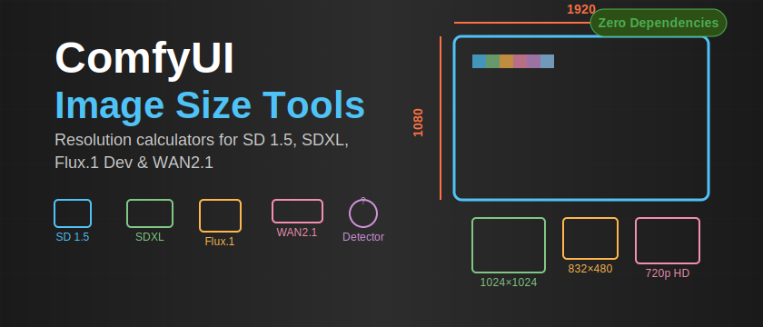

# ComfyUI Image Size Tools

A professional resolution calculator node pack for ComfyUI that provides model-specific, constraint-aware image dimensions for optimal AI generation quality.



## Why This Tool Exists

Most existing resolution tools either:

- Force you to manually enter width/height (error-prone)
- Ignore model-specific training constraints
- Provide arbitrary resolutions that hurt generation quality
- Break your ComfyUI installation with complex dependencies

This tool solves the **resolution calculation problem** by providing curated, model-optimized presets based on actual training specifications and bucket systems.

## Features

✅ **Zero Dependencies** - No external libraries, no conflicts, no breakage  
✅ **Model-Aware** - Respects VAE constraints (div by 8/64) and training buckets  
✅ **Quality Focused** - Uses actual SDXL bucket resolutions, not arbitrary calculations  
✅ **Plug & Play** - Simple dropdowns, clean outputs, works immediately  
✅ **Professional** - Semantic versioning, proper documentation, stable API  

## Included Nodes

### SD 1.5 Resolution

- **8 optimized presets** from 512×512 to 912×512
- **Divisible by 8** constraint validation (VAE requirement)
- **Outputs:** `width`, `height`, `aspect_ratio`

### SDXL Resolution  

- **13 bucket-trained presets** targeting ~1 megapixel
- **Divisible by 64** constraint validation
- **Based on the 43-bucket training system** for optimal quality
- **Outputs:** `width`, `height`, `aspect_ratio`, `total_pixels`

### Flux.1 Dev Resolution

- **11 practical presets** from 1024×1024 to 2560×1440
- **No strict constraints** - more flexible than SD models
- **Hardware-optimized** for common use cases
- **Outputs:** `width`, `height`, `aspect_ratio`

### WAN2.1 Resolution

- **4 core video presets** - 480p and 720p in landscape/portrait
- **Even-number dimensions** for video encoding compatibility
- **VRAM optimization** - includes halved dimensions for lower memory usage
- **Outputs:** `width`, `height`, `aspect_ratio`, `halved_width`, `halved_height`

### WAN2.1 Advanced Resolution

- **12 extended video presets** - includes 4:3, 3:4, 1:1, and intermediate sizes
- **Multiple aspect ratios** for diverse video generation needs
- **VRAM optimization** - includes halved dimensions for lower memory usage
- **Outputs:** `width`, `height`, `aspect_ratio`, `halved_width`, `halved_height`

### Image Size Detector

- **Dynamic size detection** - takes any image input and outputs dimensions
- **Workflow integration** - determine existing image sizes in your workflow
- **Outputs:** `width`, `height`

## Installation

### Method 1: ComfyUI Manager (Recommended)

1. Open ComfyUI Manager in your ComfyUI interface
2. Go to "Install Custom Nodes"
3. Search for "Image Size Tools" or install from Git URL: `https://github.com/TheLustriVA/ComfyUI-Image-Size-Tools`
4. Click Install and restart ComfyUI

### Method 2: Git Clone  

```bash
cd ComfyUI/custom_nodes
git clone https://github.com/TheLustriVA/ComfyUI-Image-Size-Tools.git
```

### Method 3: ComfyUI Registry (Future)

```bash
comfy node install image-size-tool
```

*Note: Registry installation will be available once published to the official ComfyUI Registry*

No additional dependencies to install - just restart ComfyUI.

## Usage

1. **Add Node**: Search for "Image Size Tools" in the node menu
2. **Select Resolution**: Choose from the dropdown (e.g., "1920×1080 (16:9) - Full HD")
3. **Connect Outputs**: Wire `width` and `height` to your Empty Latent Image node
4. **Generate**: Enjoy optimal quality with proper model constraints

### Example Workflow

```txt
[Flux.1 Dev Resolution] → [Empty Latent Image] → [KSampler] → [VAE Decode] → [Save Image]
     ↓ width=1920
     ↓ height=1080
```

## Why Model-Specific Resolutions Matter

### SD 1.5

- **Trained at 512×512** - quality degrades significantly when deviating
- **VAE constraint** - dimensions must be divisible by 8 or generation fails

### SDXL  

- **Bucket training system** - uses 43 specific resolutions targeting 1MP
- **Quality buckets** - arbitrary resolutions produce inferior results
- **VAE constraint** - dimensions must be divisible by 64

### Flux.1 Dev

- **Flexible architecture** - handles 0.2 to 2 megapixels effectively  
- **Hardware optimized** - common resolutions for practical generation

### WAN2.1

- **Video generation model** - optimized for 480p/720p video output
- **VRAM considerations** - includes halved dimensions for memory optimization
- **Even dimensions** - ensures video encoding compatibility

## Troubleshooting

### Nodes Don't Appear

```bash
cd ComfyUI/custom_nodes/ComfyUI-Image-Size-Tool
git pull
find . -name "__pycache__" -exec rm -rf {} +
```

Then restart ComfyUI.

### Import Errors (If Any)

This tool uses zero external dependencies and a single-file architecture specifically to avoid import issues. If you encounter problems, please open an issue.

## Technical Details

- **Architecture**: Single-file design with embedded constants
- **Dependencies**: None (Python stdlib only)
- **Compatibility**: ComfyUI (all recent versions)
- **Performance**: Instant loading, zero overhead

## Contributing

Issues and pull requests welcome! This tool aims to be the definitive resolution calculator for ComfyUI.

## License

MIT License - see LICENSE file for details.

---

**Generated with professional AI development practices**  
*No more resolution guesswork - just optimal image generation*
